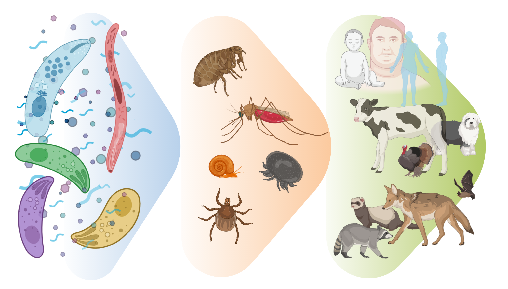

----
# Introduction  

Apicomplexans are a large phylum of single-celled eukaryotes, all of which are obligate endoparasites of metazoa except in the rarest of cases [@saffo_nephromyces_2010]. The phylum is named for their apical complex, a unique organellar structure specialized for host-cell invasion. They often have complex life-cycles that can involve several hosts [@seeber_recent_2016]. 
As the agents responsible for many common and serious diseases - including malaria, toxoplasmosis, babesiosis, cryptosporiosis, *etc*. - they represent a major burden to health and economy across the globe [@flegr_toxoplasmosis_2014; @kristmundsson_harmless_2018]. 
It is of great interest to detect and classify these organisms as a first step towards diagnosis and treatment.

```{r Fig1, out.width = "400px", fig.align='center'}

```
**Figure 1**. Apicomplexa are eukaryotic endoparasites of metazoa. Their life-cycles can be complex, involving transmission by ectoparasitic vectors such as ticks or mosquitoes. Health and economic impacts of this group are significant as they affect wildlife, livestock, and humans globally. (Figure made with BioRender)

\hfill\break   

Detection of parasites has traditionally been performed by tedious microscopic analyses [@renoux_developing_2017].
Currently, DNA barcoding allows for the simultaneous identification of many organisms in an environmental sample by sequencing a chosen marker gene. 
k-mer profiles of marker genes can be used for classification in lieu of computationally costly-alignments [@wang_naive_2007]. 
These methods are superior in speed and accuracy compared to BLAST, provided that the classifier is trained on an adequate reference database [@porter_automated_2018]. Ribosomal RNA genes, particularly the eukaryotic 18S and prokaryotic 16S, are commonly used as phylogenetic markers in studies of complex environmental samples.

In this work, I evaluated the performance of popular classification algorithms on the task of genus-level assignment of unknown apicomplexan 18S sequences. I selected the best performing algorithm (random forest) to create a species-level classifier for 18S sequences of the most common apicomplexan species in the NCBI database. Additionally, the classifier was tested against a set of sequences from closely related species of the genera *Babesia* and *Thelieria*.

----

# Code and Analysis

```{r setup, include=FALSE}
knitr::opts_chunk$set(
  cache = TRUE,
	echo = TRUE,
	message = FALSE,
	warning = FALSE
)

# create subdirectories if not already present
if (!dir.exists(file.path('.','data'))){
  dir.create(file.path('.', 'data'))
}
if (!dir.exists(file.path('.','results'))){ 
  dir.create(file.path('.', 'results'))
}
if (!dir.exists(file.path('.','models'))){ 
  dir.create(file.path('.', 'models'))
}
```

#### Libraries


```{r Libraries, message=FALSE, warning=FALSE}
## Libraries
# install.packages('tidyverse')
library(tidyverse) # always and forever
# install.packages('rentrez')
library(rentrez) # for ncbi downloads
# install.packages('Biostrings')
library(Biostrings) # for sequence handling
# install.packages('patchwork')
library(patchwork) # to arrange multiple plots
# install.packages('ggthemes')
library(ggthemes) # plot themes
# install.packages('ggridges')
library(ggridges) # for ridge density plots
# install.packages('rcartocolor')
library(rcartocolor) # for pretty plot colours
# install.packages('caret')
library(caret) # for everything machine learning-related
# install.packages('doParallel')
library(doParallel) # allows parallelization of training tasks
# install.packages('beepr')
library(beepr) # makes beep sounds (for when long computation finishes)
# install.packages('kableExtra')
library(kableExtra)
# install.packages('gbm')
library(gbm)
# install.packages('klaR')
library(klaR)
# install.packages('randomForest')
library(randomForest)
# install.library('ggplot2')
library(ggplot2)
# install.packages('rpart')
library(rpart)
# install.packages('rattle')
library(rattle)
# install.packages('Biostrings)
library(Biostrings)
# install.packages('muscle')
library(muscle)
# install.packages('DECIPHER')
library(DECIPHER)
```

```{r Variables}
#Log variables changed by input parameters

#Individual search parameters
goi <- params$goi
taxGroup <- params$taxGroup
seqLenStart <- params$seqLen[1]
seqLenEnd <- params$seqLen[2]
molType <- params$molType

#Full search term for NCBI data search (first called in get_ncbi_ids function)
searchexp <- sprintf("%s[Title] AND %s[Organism] AND %s:%s[SLEN] AND %s[PROP] NOT genome[TITL] AND (ddbj_embl_genbank[filter] OR refseq[filter])", goi, taxGroup, seqLenStart, seqLenEnd, molType)

#Unique NCBI identifier (first called in get_ESummary_df function)
apikey <- params$apiKey

```

```{r Functions}
#Functions for batch downloads from NCBI are shown in the code below

# get_ncbi_ids does a basic NCBI search; gets metadata and record ids; 
# sets up the fetching process in get_ESummary_df and get_Efasta functions.
get_ncbi_ids <- function(searchexp, db){
  
  # find out how many ids available from 1st search
  Esearch <- rentrez::entrez_search(
    db = db, 
    term = searchexp, 
    retmax = 100)
  # use 'count' from first search to get all ids; get web history with 'use_history = TRUE'
  Esearch2 <- rentrez::entrez_search(
    db = db, 
    term = searchexp, 
    retmax = Esearch$count,
    use_history = TRUE)
  message('Returning metadata from basic search...')
  print(Esearch2)
  return(Esearch2)
}

# get_ESummary_df downloads all NCBI nucleotide summary records for a
#  search expression and returns a dataframe
get_ESummary_df <- function(searchexp, db, apikey){
  
  # perform basic search to get webhistory and records count
  basic_search <- get_ncbi_ids(searchexp, db)
  web_history <- basic_search$web_history
  id.count <- basic_search$count
  
  # init list to gather downloads 
  Esummary_list <- list()
  # init df to compile records from all downloads
  df <- tibble(id = basic_search$ids)
  
  # display downloads progress
  message('Getting summaries....')
  progress_bar = txtProgressBar(min=0, max=id.count, style = 1, char="=")
  
  # iterate until all summary records obtained
  for (i in seq(1, id.count, 500)) {
    # print(paste0(round(i/id.count*100), '%'))
    # add each query to growing Esummary list
    Esummary_list <-  c(
      Esummary_list,
      entrez_summary(db = db, web_history = web_history,
                     retstart = i-1, retmax=500, api_key = apikey,
                     always_return_list = TRUE, retmode = 'json')
    )
    setTxtProgressBar(progress_bar, value = i)
    Sys.sleep(0.11)
  }
  message('\ndone downloads....\nflattening lists....')
  df <- df %>%
    mutate(listcol = Esummary_list) %>%
    unnest_wider(listcol)
  return(df)
}

# get_Efasta gets all sequences for a search expression,
#   returns a dataframe with title and sequence
get_Efasta <- function(searchexp, apikey) {
  basic_search <- get_ncbi_ids(searchexp, 'nuccore')
  webhist <- basic_search$web_history
  id.count <- basic_search$count
  
  message(paste('Fetching', id.count, 'fasta records'))
  progress_bar = txtProgressBar(min=0, max=id.count, style = 1, char="=")
  
  fasta <- ''
  for (i in seq(1, id.count, 500)){
    temp <- entrez_fetch(db = "nuccore", web_history = webhist,
                         retstart = i-1, retmax=500, api_key = apikey,
                         rettype = 'fasta')
    fasta <- paste0(fasta, temp)
    setTxtProgressBar(progress_bar, value = i)
  }
  # split fasta into lines and write a temp file
  write(fasta, "temp.fasta", sep = "\n")
  # read lines as a DNAStringSet object using Biostrings package
  fasta <- Biostrings::readDNAStringSet("temp.fasta")
  # delete temp file
  file.remove('temp.fasta')
  # arrange fasta into df
  fasta.df <- data.frame(title = names(fasta), seq = paste(fasta))
  message('Done!')
  return(fasta.df)
}

#Functions for K-mer classification are shown in the code below

# generates sequence feature columns [(1-4)-mers] for classification
generate_kmer_features <- function(df){
  df <- as.data.frame(df)
  df$seq <- Biostrings::DNAStringSet(df$seq)
  features.df <- df %>%
    cbind(
      Biostrings::letterFrequency(df$seq, letters = c('A', 'C','G'),
                      as.prob = TRUE),
      Biostrings::dinucleotideFrequency(df$seq, as.prob = TRUE),
      Biostrings::trinucleotideFrequency(df$seq, as.prob = TRUE),
      Biostrings::oligonucleotideFrequency(df$seq, 4, as.prob = TRUE)
    ) %>%
    dplyr::select(-seq) 
  return(features.df)
}
```


----

## Analysis


#### 18S sequence data acquisition  

\hfill\break   

I obtained 15,093 apicomplexan 18S ribosomal rRNA sequences from the NCBI 'nuccore' database using the `rentrez` R package on 2020-10-20. Retrieved sequences were 300-2500 bp long, nuclear genomic sequences only, and only from Genbank or RefSeq record collections (search expression: "*18S ribosomal rna[Title] AND "apicomplexa"[Organism] AND 300:2500[SLEN] AND biomol_genomic[PROP] NOT genome[TITL] AND (ddbj_embl_genbank[filter] OR refseq[filter])*". 


- Downloading the NCBI Apicomplexa 18S sequence dataset

```{r Downloads}
# apikey <- 889fdb9786a14019a0a1257196a09ba4ba08

# apicomplexa 18S, between 300-2500 bp, not from a genome,
#  from genbank or refseq collections:
# searchexp <- '18S ribosomal rna[Title] AND "apicomplexa"[Organism] AND
#     300:2500[SLEN] AND biomol_genomic[PROP] NOT genome[TITL] AND
#     (ddbj_embl_genbank[filter] OR refseq[filter])'

# Get search metadata, summaries, sequences
apicomplexa.search <- get_ncbi_ids(searchexp, db = 'nuccore')
apicomplexa.summary.df <- get_ESummary_df(searchexp, 'nuccore', apikey)
beep(2)
apicomplexa.fasta <- get_Efasta(searchexp, apikey)
beep(2)

# combine summary data and fasta data
apicomplexa.df <- apicomplexa.summary.df %>%
  bind_cols(apicomplexa.fasta)
head(glimpse(apicomplexa.df))
# save to file, clean up workspace
write_rds(apicomplexa.df, './data/apicomplexa.rds')
rm(list=setdiff(ls(), "apicomplexa.df"))
```

------

#### Sequence quality control and filtering  

\hfill\break   

Taxonomic labels were checked for consistency and edited where necessary. Records were discarded if they met any of the following criteria:

- ambiguous organism name (uncultured, sp., cf. labels)
- molecule type not explicitly labelled as nuclear genomic DNA
- contains any non-ACGT characters
- duplicated sequence already in database
- record title contains 'internally transcribed spacer' or 'ITS'

Upon checking the distribution of sequence lengths, I found that they differ widely between taxa; hence, I decided not to filter by sequence length but to simply keep this in mind (fig. 2).


- Some initial tidying of the NCBI dataset

```{r Initial Tidy}
# read downloaded data
apicomplexa.df <- read_rds('./data/apicomplexa.rds')

# tidy data up for analysis
apicomplexa.df <- apicomplexa.df %>%
  # make strings into factors; rename title
  mutate(across(where(is.character), as.factor)) %>%
  mutate(taxid = factor(taxid)) %>%
  dplyr::rename(title = title...4)  %>%
  # replace blanks with explicit NA
  mutate(across(where(is.character), ~na_if(.x, ''))) %>%
  # drop unwanted cols (data not used in this analysis)
  dplyr::select(
    -c(biosample, strain, statistics, geneticcode, tech,
       contains('sub'), projectid, properties, oslt, title...34,
       extra, contains('assembly'), flags, contains('date'),
       completeness, uid, gi, segsetsize, accessionversion,
       sourcedb)) %>%
  dplyr::select(id, organism, dplyr::everything())
glimpse(apicomplexa.df)
```


- Sequence record QC checks

```{r Sequence QC}
## Various data checks:
# what proportion are 'partial sequences'? nearly all
summary(str_detect(tolower(apicomplexa.df$title), 'partial sequence'))
# could I use a certain region based on titles? nope
head(table(str_extract(apicomplexa.df$title, 'V[0-9]+(.)+')) %>%
       sort(decreasing = TRUE))
# How many have any ambig. bases?
summary(str_count(apicomplexa.df$seq, '[^ACGT]'))
# First ambiguous base encountered?
summary(factor(str_extract(apicomplexa.df$seq, '[^ACGT]')))
# verify that there are no gaps in any of the sequences
sum(str_count(apicomplexa.df$seq, '-')>0)

```


- Tidying taxonomic labels and filtering poorly-described taxa

```{r Tidy + Filter}
# Tidying taxonomy info and creating genus labels for classfication
apicomplexa.df <- apicomplexa.df %>%
  mutate(
    # fix organism names for consistency
    organism = str_replace(organism, 'malaria parasite P\\.', 'Plasmodium'),
    organism = ifelse(str_detect(organism, 'Babesia canis'),
                      'Babesia canis', organism),
    organism = ifelse(str_detect(organism, 'Plasmodium ovale'), 
                      'Plasmodium ovale', organism),
    organism = str_remove_all(organism, ' complex isolate [0-9]+'),
    # extract genus names from organism name
    genus = factor(str_extract(organism, '^[A-Za-z]+')))
dim(apicomplexa.df)

# Any records with ambiguous names were discarded. ('uncultured..', 'sp.', 'cf.'). 
ambiguous_patterns <- paste0(c('sp\\.(.)*','cf\\.(.)*', 'uncultured', 
                  'environmental (sequence|sample)', '^[Aa]picomplexa*'),
                  collapse = '|')
apicomplexa.df <- apicomplexa.df %>%
  filter(!str_detect(organism, ambiguous_patterns))
dim(apicomplexa.df)
rm(ambiguous_patterns)


summary(str_detect(tolower(apicomplexa.df$title), 'internal transcribed spacer'))
summary(str_detect(apicomplexa.df$title, 'ITS'))

# get rid of anything that might have neighboring regions (ITS)
apicomplexa.df <- apicomplexa.df %>%
  filter(!str_detect(title, 'internal transcribed spacer|ITS'))
dim(apicomplexa.df)

```

- Filtering based on sequence label info

```{r Label Filter}
# discard any sequences that ae not labeled as dna; 
# keep genomic, not mitochondrial, plastid, or ambiguous genome
apicomplexa.df <- apicomplexa.df %>%
  filter(moltype == 'dna' & genome == 'genomic')
dim(apicomplexa.df)

# remove any seqs with non ACGT bases 
apicomplexa.df <- apicomplexa.df %>%
  filter(!str_detect(seq, "[^ACGT]")) 
dim(apicomplexa.df)

# remove any duplicates sequences
apicomplexa.df <- apicomplexa.df %>%
  group_by(seq) %>%
  sample_n(1) %>%
  ungroup() %>%
  # drop any unused factor levels in all factor variables 
  mutate(across(where(is.factor), fct_drop)) %>%
  # keep only useful columns for further steps
  dplyr::select(id, organism, genus, seq, slen)

glimpse(apicomplexa.df)
```
- Plot Fig 2
```{r Fig2}
ggplot(data=apicomplexa.df, aes(apicomplexa.df$slen)) + 
  geom_histogram(binwidth = 50) +
  xlab("Sequence Length (Nucleotides)") +
  ylab("Number of Sequences")
```
**Figure 2** Histogram of sequence lengths shows several distinct peaks, indicating the dataset does not follow a normal distribution. Further investigation of the data composition will be performed, then the data will be split relevant groups for classifier training and validation.


----

#### Sampling, feature generation and data-splitting

\hfill\break  

After filtering, ~ 5 k sequences remained in the dataset, belonging to 350 different species from 50 genera. However, the top seven genera account for the vast majority of the sequences and a similar distribution is present at the species-rank.
I created three subsets of sequences for classifier training and validation:

- *'genus-rank' dataset*: 1,575 18S sequences, evenly split between seven genera: *Babesia*, *Cryptosporidium*, *Theileria*, *Sarcocystis*, *Hepatozoon*, *Eimeria*, *Plasmodium*
 - *species-rank dataset*: 1,180 18S sequences, sampled equally from the 20 most common apicomplexan species in the filtered data
 - *Babesia & Theileria dataset*: 686 sequences sampled equally from 14 closely-related species of genera *Babesia* and *Theileria*

Proportions of (1-4)-mers were generated for each dataset using `Biostrings`; all datasets were split 50-50 into training and validation sets using the `caret` package prior to training.


```{r Data Overview}
# How many sequences? species present? genera?
nrow(apicomplexa.df)
length(unique(apicomplexa.df$organism))
length(levels(apicomplexa.df$genus))

# Count sequences by genera
count <- table(apicomplexa.df$genus) %>% sort(decreasing = TRUE)
genus <- names(count)
genus_table <- tibble(genus, count) %>%
  mutate(pct = count/nrow(apicomplexa.df)*100)
kable(head(genus_table, 10), format = 'simple')


# Count sequences by organism labels (species, sometimes strain)
count <- table(apicomplexa.df$organism) %>% sort(decreasing = TRUE)
organism <- names(count)
species_table <- tibble(organism, count) %>%
  mutate(pct = count/nrow(apicomplexa.df)*100) %>%
  left_join(apicomplexa.df %>% dplyr::select(genus, organism) %>% distinct(), by = 'organism')
kable(head(species_table, 20), format = 'simple')

rm(count, genus, organism)
```
**Table 1** 
- Creating down-sampled datasets with selected common taxa

```{r Down-sampling}
## dataset 1: genus-rank: 7 genera * 225 seqs
# create genera dataset with top 7 genera
genera.df <- apicomplexa.df %>%
  filter(as.character(genus) %in% genus_table[1:7, 'genus'][[1]]) %>%
  mutate(genus = fct_drop(genus))

## down-sampling all genera to match genus with smallest number of sequences
genera.df <- downSample(genera.df, factor(genera.df$genus))
table(genera.df$genus)


## dataset 2: species-rank: 20 species * 59 seqs
# create species dataset with top 20 species
species.df <- apicomplexa.df %>%
  filter(organism %in% species_table[1:20, 'organism'][[1]]) %>%
  mutate(organism = fct_drop(organism))

# down-sampling all species to match smallest group
species.df <- downSample(species.df,
                             factor(species.df$organism))
table(species.df$organism)


## dataset 3: 14 Babesia and Theileria species * 49 seqs
# create a babesia & theileria species dataset
babes_theiler.df <- apicomplexa.df %>%
  filter(organism %in% species_table[1:25, ][[1]]) %>%
  filter(genus %in% c('Babesia', 'Theileria')) %>%
  mutate(organism = fct_drop(organism))

# down-sampling all species to match smallest group
babes_theiler.df <- downSample(babes_theiler.df,
                             factor(babes_theiler.df$organism))
table(babes_theiler.df$organism)

write_rds(genera.df, "./data/dataset.genera.rds")
write_rds(species.df, "./data/dataset.species.rds")
write_rds(babes_theiler.df, "./data/dataset.babesia_theileria.rds")
```

- plot fig.3

```{r Fig3, fig.height=3.5, fig.width=7}
# Plot fig.2: EDA of sequences in genus-rank dataset

# genus-rank dataset (training and test, before splitting)
df <- genera.df

# plot sequence length density function by genus for selection
seqlen.plot <- df %>%
  ggplot(aes(x=slen, y = genus, fill = genus, colour = genus)) +
  geom_density_ridges(panel_scaling = TRUE, alpha = 0.7) +
  geom_rangeframe(color = 'darkgrey') +
  labs(x = '18S sequence length (bp)', y = 'Genus') +
  scale_y_discrete(limits = rev(levels(df$genus))) +
  scale_color_carto_d() + scale_fill_carto_d() +
  theme_tufte(base_family = 'sans') +
  theme(plot.caption = element_text(hjust=1.4, size=rel(0.8)),
        legend.position = 'none')

## get mean, sd of GC content for each genus in selected genera 
gc.df <- df %>%
  mutate(
    seq = as.character(seq),
    `GC %` = str_count(as.character(seq), '[CG]')/nchar(seq)
  ) %>%
  group_by(genus) %>%
  summarize(mean_gc = mean(`GC %`, na.rm = TRUE),
            sd_gc = sd(`GC %`, na.rm = TRUE))

# plot GC content as a pointrange geom with gc content on x-axis
gc.pointrange <- ggplot(gc.df,
                  aes(y = genus, x = mean_gc, xmin = mean_gc - sd_gc,
                    xmax = mean_gc + sd_gc, colour = genus)) + 
  geom_pointrange() +
  geom_rangeframe(color = 'darkgrey') +
  labs(y='', x='GC %') +
  scale_y_discrete(limits = rev(levels(df$genus))) +
  scale_color_carto_d() +
  theme_tufte(base_family = 'sans') +
  theme(legend.position = 'none', axis.text.y = element_blank())

# jitter plot: y=genus, x=# seqs, each point is a species
species.plot <- df %>%
  group_by(genus, organism) %>%
  summarize(n = n()) %>%
  mutate(text=ifelse(n>50, organism, '')) %>%
  ggplot(aes(y= genus, x = n, colour = genus)) + 
  geom_jitter(height = 0.25, width=0.1, alpha = 0.7, size = 1.4) +
  labs(x = 'Number of Sequences', y='') +
  geom_rangeframe(color = 'darkgrey') +
  # geom_text(aes(label=text, size = 9)) +
  scale_y_discrete(limits = rev(levels(df$genus))) +
  scale_x_log10() +
  scale_color_carto_d() + scale_fill_carto_d() +
  theme_tufte(base_family = 'sans') +
  theme(legend.position = 'none', axis.text.y = element_blank())

plot.genus.eda <- seqlen.plot + gc.pointrange + species.plot 
plot.genus.eda
write_rds(plot.genus.eda, './results/plot.genus.eda.rds')
rm(seqlen.plot, gc.pointrange, species.plot, gc.df, df, species_table, genus_table)
```

**Figure 3**. Characteristics of sequences from seven apicomlexan genera in the data used in comparing various classification algorithms (RF, NB, GBM, kNN). *left*: Sequence length varies by genera with some groups being bimodal; *middle*: GC-content for each genus (mean+/-sd); *right*: The dataset contains 208 species; to illustrate the distribution of sequences to species within each genera, each species is represented as a point and plotted the sequence count (eg. *Eimeria* and *Theileria* contain many species with low representation in the dataset; *Hepatozoon* and *Plasmodium* each contain one species that accounts for a large proportion of the sequences).

- Sequence alignment
```{r Alignment}
#For reproducibility
set.seed(1) 

#Subset data for each genus for manageable alignment
genera.sampled <- genera.df %>%
  group_by(genus) %>%
  sample_n(10) 

#Merge species name + unique ID for visualizing later
genera.sampled$org_id <- paste(genera.sampled$organism, genera.sampled$id, sep=" ")

#Convert sequence to DNAStringSet format
genera.sampled.df <- as.data.frame(genera.sampled)
generaSeqs <- DNAStringSet(genera.sampled$seq)

#Add name identifiers to sequences
names(generaSeqs) <- genera.sampled$org_id

#Align sequences
genera.aligned <- DNAStringSet(muscle::muscle(generaSeqs))
BrowseSeqs(genera.aligned) #Sequence must be viewed in browswer
```

10 randomly sampled sequences per genus were aligned. Sequences are highly variable across genera, but the presence of several regions of homology indicates they likely come from the same genetic region. Sequences were viewed in browser.
----

### Feature generation: k-mer profiles

Because the number of k-mers increases by a factor of four with length and I wanted to keep computation times short, I decided to use the proportions of all (1-4)-mers to generate profiles for classification. There are 339 variables in the k-mer profiles ('T' is excluded). Longer kmers are more discriminatory, but with k>5 the number of possible k-mers would exceed the number of observations in the training datasets.


```{r Feature generation}
# Generate features for each dataset: genera, species, babesia+theileria
genera.feat.df <-  genera.df %>%
  generate_kmer_features(.) %>%
  dplyr::select(-Class)

species.feat.df <-  species.df %>%
  generate_kmer_features(.) %>%
  dplyr::select(-Class)

babes_theiler.feat.df <-babes_theiler.df %>%
  generate_kmer_features(.) %>%
  dplyr::select(-Class)
 
```


- plot k-mer profiles by genus (fig. 4)

```{r Fig4, fig.height=4, fig.width=8}
plot.kmer.profiles <- genera.feat.df %>%
  # get-wide format
  dplyr::select(genus, AAAA:TTTT) %>%
  pivot_longer(cols = AAAA:TTTT, names_to = 'kmer', 
               values_to = 'proportion') %>%
  # plot 4mer profiles for each genus in a panel
  ggplot(aes(x=proportion+0.0001, y = kmer)) +
  geom_jitter(size=0.01, color='black', alpha = 0.02) + 
  geom_rangeframe() +
  xlim(0,0.035) +
  scale_x_log10() +
  facet_wrap(~genus, nrow = 2) +
  theme_tufte(base_family = 'sans') +
  labs(x = 'K-mer Proportion', y = '4-mers (Lexicographically)') +
  theme(axis.title.y = element_text(angle = 90),
        axis.text.y = element_text(),
        axis.text.x = element_blank(), axis.ticks.x = element_blank()) +
  coord_flip() 
plot.kmer.profiles
write_rds(plot.kmer.profiles, "./results/plot.kmer.profiles.rds")
```
**Figure 4.** 18S rRNA 4-mer profiles of apicomplexan genera give a sense of group differences in the genus-rank dataset that was used to compare classification algorithms. Each point shows the proportion (y-axis) of a k-mer (lexicographically along x-axis) in a single sequence; all sequences for a given genus are plotted in the same panel. Zero-values of k-mer proportions are shown as 1e-04. Some patterns may be emphasized by the uneven distribution of sequences between species within genera (fig.4:right).

-----

- k-mer proportions are not normally distributed (Shapiro-Wilk test)

```{r Shapiro, message=FALSE, warning=FALSE, fig.height=2}
kmer_proportions <- genera.feat.df %>%
  dplyr::select(genus, AAAA:TTTG) %>%
  pivot_longer(cols = AAAA:TTTG, names_to = 'kmer', 
               values_to = 'proportion') 

test1 <- kmer_proportions %>%
  group_by(kmer) %>%
  summarize(shapiro_w = shapiro.test(proportion)[[1]],
            shapiro_p = shapiro.test(proportion)[[2]]) 
test1 %>%
  ggplot() +geom_histogram(aes(x=shapiro_p)) + scale_x_log10() +
  geom_rangeframe() + 
  theme_tufte(base_family = 'sans') +
  xlab("Shapiro p value") +
  ylab("Count")
```
```{r proportions, message=FALSE, warning=FALSE, fig.height=3}
kmer_proportions %>%
  filter(kmer %in% c('AAAA','CGAT','AAGG', 'GTCC', 'CGCG')) %>%
  ggplot() + 
  geom_density(aes(group = kmer, x=proportion),
               size = 0.1, ) +
  facet_wrap(~kmer, scales = 'free_x') +
  geom_rangeframe() +
  # scale_x_log10() +
  theme_tufte(base_family = 'sans') +
  xlab("K-mer Proportion") +
  ylab("Density")

rm(kmer_proportions, test1)
```


### Splitting data into train + test sets

Data were split 50-50 into training and validation datasets using the `caret` package.

```{r Data Splitting}
# for reproducibility
set.seed(1)

# Genus data: create a stratified partition of data: 50:50 train:test
inTrainingSet <- caret::createDataPartition(y = genera.feat.df$genus, p=.5, list=FALSE)
# split data rows into train, test
genusTrain <- genera.feat.df[inTrainingSet, ] %>%
  dplyr::select(genus, A:TTTT)
genusTest <- genera.feat.df[-inTrainingSet, ] %>%
  dplyr::select(genus, A:TTTT)
# 

# Species data: create a stratified partition of data: 50:50 train:test
inTrainingSet <- caret::createDataPartition(y = species.feat.df$organism, p=.5, list=FALSE)
# split data rows into train, test
speciesTrain <- species.feat.df[inTrainingSet, ] %>%
  dplyr::select(organism, A:TTTT)
speciesTest <- species.feat.df[-inTrainingSet, ] %>%
  dplyr::select(organism, A:TTTT)


# Babesia/Theileria
# Species data: create a stratified partition of data: 50:50 train:test
inTrainingSet <- caret::createDataPartition(y = babes_theiler.feat.df$organism, p=.5, list=FALSE)
# split data rows into train, test
babesiaTrain <- babes_theiler.feat.df[inTrainingSet, ] %>%
  dplyr::select(organism, A:TTTT)
babesiaTest <- babes_theiler.feat.df[-inTrainingSet, ] %>%
  dplyr::select(organism, A:TTTT)


# column index for all k-mer proportions
features <- setdiff(names(genusTrain), 'genus')

rm(inTrainingSet, genera.feat.df, species.feat.df)
```

## Classification of apicomlexan genera by various methods

I tried four different classification algorithms (random forest, stochastictic gradient boosting, naive Bayes, and k-nearest neighbors) to get an idea of which might be best suited to the specific task of classifying 18S sequences by their (1-4)-mer profiles. For each model, I used the `caret` package to perform a search through various model tuning parameters to select an optimal model. Bootstrapping (5x) was performed to strengthen accuracy estimates. Computations were parallelized to speed up the training of classifiers, using the `parallel::makeCluster

```{r Processor Clusters}
# setup cluster of processors - I had to use 'sequential' for setup strategy or fail. 
# *note* this probably doesn't work on windows, only unix-based systems. 
# Using 4 cores on my macbookpro.
cl <- parallel::makeCluster(4, setup_strategy = "sequential")

# specify bootstrapping strategy with 5 reps for better estimation of model
# accuracy. 
# Pass this list in training for each model to automate the process.
ctrl <- caret::trainControl(
  method = "boot", # boot, cv, repeatedcv,...
  number = 5,
  classProbs = TRUE,
  allowParallel = TRUE
)
```


-----

#### Random Forest (RF):

Random Forest is a powerful and robust classification/regression method based on creating a group of decision trees. Model tuning was performed by varying `mtry`, the number of variables that can be used to split data on at a given node in a tree; a general starting point is the square-root of the number of predictors (18). Optimal accuracy (99 %, sd=0.5) was achieved with `mtry` = 30, though accuracy was very high across the range applied (fig.5:RF). 

```{r Random Forest 1}

# keep track of runtime, for reference
rf.timed <- Sys.time()

# start cluster
cl <- parallel::makeCluster(4, setup_strategy = "sequential")
registerDoParallel(cl)

# train models with search grid and resample procedure
rf.model <- caret::train(x = genusTrain[, features],
                  y = genusTrain$genus,
                  method ='rf', 
                  trees=100,
                  # try different # of variables avail. per node (tuning)
                  tuneGrid =  expand.grid(.mtry = c(1,seq(5, 30, 5))),
                  trControl = ctrl,
                  verbose = FALSE
)
stopCluster(cl)
# tell me when it finishes, if ever
beepr::beep(2)
rf.timed <- Sys.time() - rf.timed
rf.timed
write_rds(rf.model, './models/random_forest.model.rds')
```

```{r 1-mer Classifier}
#Build classification tree
rpartTree1 <- rpart(formula = genus~., data = genusTrain[,1:4], method='class')
rpartTree1

#Predict test dataset
rpartPredict1 <- predict(rpartTree1, newdata = genusTrain[,2:4], type='class')

#Build contingency table
rpartEval1 <- table(genusTrain$genus, rpartPredict1)
rpartEval1

#Evaluate decision tree performance
rpartConfusionMatrix1 <- confusionMatrix(rpartPredict1, genusTrain$genus)
print(rpartConfusionMatrix1)

#Plot decision tree
fancyRpartPlot(model=rpartTree1, caption = "Genus classification", main = "1-mer Decision Tree", yshift = -10)
```
**Figure 5**. 1-mer decision tree of Apicomplexan genera.
```{r 2-mer Classification}
#Build classification tree
rpartTree2 <- rpart(formula = genus~., data = genusTrain[,c(1,5:20)], method='class')
rpartTree2

#Predict test dataset
rpartPredict2 <- predict(rpartTree2, newdata = genusTrain[,5:20], type='class')

#Build contingency table
rpartEval2 <- table(genusTrain$genus, rpartPredict2)
rpartEval2

#Evaluate decision tree performance
rpartConfusionMatrix2 <- confusionMatrix(rpartPredict2, genusTrain$genus)
print(rpartConfusionMatrix2)

#Plot decision tree
fancyRpartPlot(model=rpartTree2, caption = "Genus classification", main = "2-mer Decision Tree", yshift = -10)
```
**Figure 6**. 2-mer decision tree of Apicomplexan genera.
```{r 3-mer Classification}
#Build classification tree
rpartTree3 <- rpart(formula = genus~., data = genusTrain[,c(1,21:84)], method='class')
rpartTree3

#Predict test dataset
rpartPredict3 <- predict(rpartTree3, newdata = genusTrain[,21:84], type='class')

#Build contingency table
rpartEval3 <- table(genusTrain$genus, rpartPredict3)
rpartEval3

#Evaluate decision tree performance
rpartConfusionMatrix3 <- confusionMatrix(rpartPredict3, genusTrain$genus)
print(rpartConfusionMatrix3)

#Plot decision tree
fancyRpartPlot(model=rpartTree3, caption = "Genus classification", main = "3-mer Decision Tree", yshift = -10)
```
**Figure 7**. 3-mer decision tree of Apicomplexan genera.
```{r 4-mer Classification}
#Build classification tree
rpartTree4 <- rpart(formula = genus~., data = genusTrain[,c(1,85:340)], method='class')
rpartTree4

#Predict test dataset
rpartPredict4 <- predict(rpartTree4, newdata = genusTrain[,85:340], type='class')

#Build contingency table
rpartEval4 <- table(genusTrain$genus, rpartPredict4)
rpartEval4

#Evaluate decision tree performance
rpartConfusionMatrix4 <- confusionMatrix(rpartPredict4, genusTrain$genus)
print(rpartConfusionMatrix4)

#Plot decision tree
fancyRpartPlot(model=rpartTree4, caption = "Genus classification", main = "4-mer Decision Tree", yshift = -10)
```
**Figure 8**. 4-mer decision tree of Apicomplexan genera.

#### Stochastic gradient boosting (GBM):

Similar to random forest, stochastic gradient boosting also employs a  another tree ensemble-based approach, except with a large number of tiny decision stumps strengthened through 'boosting'. GBM is prone to over-training as the algorithm doesn't stop automatically. Two tuning searches over a range of stump-depths (1,2, or 3 per node; GBM1), learning rates (0.01, 0.1; GBM2), and boosting iterations (50-150 GBM1; 100-500 GBM2). After performing the first tuning search (fig.9:GBM1), it appeared that the optimal model (`depth`=2, `ntree`=150) could still be improved with more boosting iterations. This was not the case, though it was confirmed that the model would not be improved by decreasing the learning rate, given 100-500 boosting iterations (fig.10:GBM2). Bootstrapped accuracy estimates of the GBM1 and GBM2 models were 98 % (sd=0.6) and 97.5 % (sd=0.7).


```{r gbm1}
gbm.timed <- Sys.time()
cl <- parallel::makeCluster(4, setup_strategy = "sequential")
registerDoParallel(cl)

# train the gbm model without preprocessing of kmer proportions
gbm.model <- caret::train(
  x = genusTrain[, features],
  y = genusTrain$genus,
  method ='gbm', 
  trControl = ctrl
)
# tell me when it finishes, I'm going for coffee
stopCluster(cl)
beep(2)
gbm.timed <- Sys.time() - gbm.timed
write_rds(gbm.model, './models/gbm.model.rds')
```

- Accuracy appears to be ~98% according to resampling. I tried to find an optimal GBM classifier by tuning the number of trees (n.trees) and the learning rate (shrinkage).


```{r gbm2}
# set tuning search grid (4*1*2*1) = 8 models
grid <- expand.grid(
  # Boosting Iterations
  n.trees = c(100, 250, 500),
  # Max tree depth
  interaction.depth = 2,
  # learning rate - ie rate of gradient descent
  shrinkage = c(0.01, 0.1),
  # number of obs at leaf node (least important param, 10 is default)
  n.minobsinnode = 10
)

gbm2.timed <- Sys.time()
cl <- parallel::makeCluster(4, setup_strategy = "sequential")
registerDoParallel(cl)

# train the gbm model without preprocessing of kmer proportions
gbm.model2 <- caret::train(
  x = genusTrain[, features],
  y = genusTrain$genus,
  method ='gbm', 
  trControl = ctrl,
  tuneGrid = grid,
  verbose = FALSE
)
# tell me when it finishes, I'm going for coffee
stopCluster(cl)
beep(2)
gbm2.timed <- Sys.time() - gbm2.timed
write_rds(gbm.model2, './models/gbm.model2.rds')
```


The increased learning rate of the (1 vs 0.1 *shrinkage*) had a much greater effect than increasing the amount of boosting iterations (ntrees). Overall GBM performed well with an overall accuracy of ~98.5% on the validation data, only marginally worse than the random forest classifier (though within the range of error).


#### Naive Bayes (NB):

Naive Bayes uses a probabilistic approach to classification that makes strong assumptions of linear independence of predictor variables.
For these models, I centered and scaled (mean=0, sd=1) each k-mer proportion variable in the train and test datasets (using the `caret` package once again).
For naive Bayes, the Gaussian model was better that one using a non-parametric distribution (Fig.5:NB). Training accuracy was 93.8% (sd. 3.8; Kappa 0.93+/-0.04), which was worse than the RF, GBM and kNN classifiers. 

```{r nb, warning=FALSE}

# setup cluster of processors (4 on my macbook)
cl <- parallel::makeCluster(4, setup_strategy = "sequential")
registerDoParallel(cl)

# keep track of runtime, for reference
nb1.timed <- Sys.time()

# train the naive bayes model without preprocessing
nb.model <- caret::train(
  x = genusTrain[, features],
  y = genusTrain$genus,
  method ='nb',
  preProc= c("center", "scale"),
  trControl = ctrl,
  verbose = FALSE
)
nb1.timed <- Sys.time()-nb1.timed
beep(2)
write_rds(nb.model, './models/nb.model.rds')
print(nb.model)
```


#### K-Nearest neighbours (kNN):

kNN is a distance-based algorithm that requires data to be normalized, so centering and scaling were performed prior to training. Ten models with varying *k* (5-23) all had high accuracy, though performance was best with fewer neighbours (fig.4:kNN). The best model (*k*=5) had accuracy of 98.4 % (sd: 0.63 %), rivaling the random forest classifier.


```{r knn train, message=FALSE, warning=FALSE}

cl <- parallel::makeCluster(4, setup_strategy = "sequential")
registerDoParallel(cl)
knn.timed <- Sys.time()

# train k-NN model
knn.model <- caret::train(
  x = genusTrain[, features],
  y = genusTrain$genus,
  method ='knn',
  trControl = ctrl,
  preProc= c("center", "scale"),
  tuneLength = 10
)
stopCluster(cl)
knn.timed <- Sys.time() - knn.timed
beep(2)
write_rds(knn.model, './models/knn.model.rds')
```


#### Summary of four classifiers for genus-rank assignments (training)

- Gathering all results from genus-rank classifier training and testing of four algorithms. 


```{r genus_rank training summarys, message=FALSE, warning=FALSE}
rf.model <- read_rds('./models/random_forest.model.rds')
gbm.model <- read_rds('./models/gbm.model.rds')
gbm.model2 <- read_rds('./models/gbm.model2.rds')
nb.model <- read_rds('./models/nb.model.rds')
knn.model <- read_rds('./models/knn.model.rds')

# plot tunings for each model
plot.rf.model <- ggplot(rf.model) +
  geom_rangeframe() +  theme_tufte(base_family = 'sans') +
  labs(subtitle = 'RandomForest') +
  xlab("# of Randomly Selected Predictors")
plot.gbm.model <- ggplot(gbm.model) +
  geom_rangeframe() +
  labs(subtitle = 'Stochastic Gradient Boosting 1') +
  scale_shape('Max depth') +
  scale_color_carto_d('Max depth', palette = 2) +
  theme_tufte(base_family = 'sans') +
  xlab("# of Boosting Iterations")
plot.gbm2.model <- ggplot(gbm.model2) +
  geom_rangeframe() +
  labs(subtitle = 'Stochastic Gradient Boosting 1') +
  scale_color_carto_d('Shrinkage', palette = 3, direction = 1) +
  theme_tufte(base_family = 'sans') +
  xlab("# of Boosting Iterations")
plot.nb1.model <- ggplot(nb.model) + geom_rangeframe() +
  theme_tufte(base_family = 'sans') +
  labs(subtitle = 'Naive Bayes')
plot.knn.model <- ggplot(knn.model) +
  geom_rangeframe() + theme_tufte(base_family = 'sans') +
  labs(subtitle = 'K-Nearest Neighbours') +
  xlab("# of Neighbours")
```


```{r Fig9, fig.width=8, fig.height=5, fig.align='center'}
# create a panel with all the plots from the training of each model using caret 
plot.tunings <- 
  plot.rf.model +
  plot.nb1.model + labs(y='') +
  plot.knn.model + labs(y='') +
  plot.gbm.model +
  plot.gbm2.model + labs(y='') +
  guide_area() + 
  patchwork::plot_layout(guides = 'collect')
plot.tunings
write_rds(plot.tunings, './results/plot.tunings.rds')
```
**Figure 9**. Tuning searches for each classification algorithm in training on the genus-rank dataset of apicomplexan 18S k-mer profiles. Each point represents an individual classifier explored during the tuning search by `caret::train`.


## Testing the 'genus-rank' classifiers on unknown data

Five classifiers (GBM1, GBM2, kNN, NB, RF) were tested against the genus-rank test dataset for validation.
The overall and class-specific performance measures of each classifier against unseen data were evaluated (fig. 10). 
In terms of overall accuracy, the k-NN, RF, and GBM models were outstanding (~98.5% accuracy), and differences between these were small relative to error (fig.10:left). 
Naive Bayes performed poorly in comparison, with a pitiful 94% accuracy on the unseen data. 
In terms of genus-specific performance, four algorithm (RF, GBM, kNN) show a similar performance profile, with lower performance on *Babesia* and *Theileria* sequences (fig.10:right). 
In contrast, the naive Bayes struggled on *Sarcocystis* and *Eimeria*, whereas the other classifiers performed well on these groups.

- summarize results from testing with genus-rank dataset

```{r genus_rank classifiers tests, message=FALSE, warning=FALSE}
set.seed(1)
# Test classifier with test dataset for each classifier
rf.confusion <- confusionMatrix(table(
  predict(rf.model$finalModel, genusTest[, features]),
  genusTest$genus))
gbm.confusion <- confusionMatrix(table(
  predict(gbm.model, genusTest[, features]),
  genusTest$genus))
gbm2.confusion <- confusionMatrix(table(
  predict(gbm.model2, genusTest[, features]),
  genusTest$genus))
nb.confusion <- confusionMatrix(table(
  predict(nb.model, newdata= genusTest[, features]),
  genusTest$genus))
knn.confusion <- confusionMatrix(table(
  predict(knn.model, newdata= genusTest[, features]),
  genusTest$genus))


# gather test results from genus-rank classifications
classifiers.tests <-
  list(rf.confusion,
       gbm.confusion,
       gbm2.confusion,
       nb.confusion,
       knn.confusion)

write_rds(classifiers.tests, "./results/genus_rank_test_results.rds")

# keep models from training of genus-rank classifiers
classifiers <-
  list(
    'RF' = rf.model,
    'GBM' = gbm.model,
    'GBM2' = gbm.model2,
    'NB' = nb.model,
    'kNN' = knn.model
  )
write_rds(classifiers, "./models/genus_classifier_models.rds",
          compress = 'gz')

```


- plot fig. 10: left

```{r Fig10L}
# extract overall statistics from confusion matrix obj for each model
genus.classifiers.df <- tibble(
  name = as.factor(c('RF', 'GBM', 'GBM2', 'NB', "kNN")),
  results = classifiers.tests,
  # extract overall results
  overall = map(results, 'overall'),
  overall.names = map(overall, names),
  ) %>%
  unnest(c(overall, overall.names))

# plot overall accuracy +- sd, and kappa
plot.genus.results <- genus.classifiers.df %>%
  filter(overall >0) %>%
  pivot_wider(values_from = overall, names_from = overall.names) %>%
  ggplot(aes(y = name, x = Accuracy, xmin = AccuracyLower, xmax = AccuracyUpper)) +
  geom_pointrange() +
  geom_point(aes(x = Kappa), colour = 'deeppink3') +
  geom_rangeframe(color = 'black') +
  scale_y_discrete(limits = rev(levels(factor(genus.classifiers.df$name)))) +
  scale_color_carto_d('Statistic') +
  labs(y = 'Classifier', 
       subtitle = 'Overall accuracy of different algorithms on genus-rank assignment of \napicomplexan 18S sequences from 7 genera',
       caption = 'The best model from each tuning search was tested on unseen sequences. \nPointrange indicates Accuracy +/- sd; Kappa statistic is shown as a red point.') +
  theme_tufte(base_family = 'sans')
plot.genus.results
write_rds(plot.genus.results, "./results/plot.genus.results.rds")
```


- plot accuracy of each model by genus: fig10. right

```{r Fig10, fig.height=4, fig.width=8}

byclass.df <- 
  tibble(
    Algo = c('RF', 'GBM', 'GBM2', 'NB', "kNN"),
    results = classifiers.tests
    ) %>%
  # select 'byclass' matrix from confusion results
  mutate(byclass = map(results, 4)) %>%
  # extract by-class statistics from confusion matrix obj for each model; this gets a list for each stat for each algo (where each val in list is for a genus)
  mutate(Sensitivity = map(byclass, ~.[,1]),
         Specificity = map(byclass, ~.[,2]),
         Precison = map(byclass, ~.[,5]),
         F1 = map(byclass, ~.[,7]),
         Recall = map(byclass, ~.[,6]),
         BalAccuracy = map(byclass, ~.[,11])) %>%
  # add the genus-labels for each value (list for each row)
  mutate(Genus = lapply(Sensitivity, names)) %>%
  dplyr::select(-c(results, byclass)) %>%
  # unnest to make each row an (algo, genus)-observation w cols for stats
  unnest(cols = c(Sensitivity:Genus)) %>%
  mutate(Genus = str_remove(Genus, 'Class: ')) %>%
  group_by(Algo, Genus) %>%
  # pivot stats columns to long-form
  pivot_longer(Sensitivity:BalAccuracy, 
               names_to = 'Statistic',
               values_to = 'Value')

plot.genus.byclass.results <- byclass.df %>%
  ggplot(aes(group = Algo, colour = Algo, shape = Algo,
             x=Genus, y = Value)) +
  geom_point(alpha = 0.65, size = 1.5) +
  geom_path(alpha = 0.65, size = 0.5) +
  labs(x='', y ='', 
       title = "Performance measures of five k-mer-based classifiers by genus") +
  facet_wrap(~Statistic, scales = 'free_y', ncol = 3) +
  scale_color_carto_d(palette = 2, 'Classifier', direction = -1) +
  scale_shape('Classifier') +
  theme_few(base_family = 'sans', base_size = 10) +
  theme(axis.line.x.bottom = element_line(colour = 'darkgrey'),
        axis.line.y.left = element_line(colour = 'darkgrey'),
        panel.grid.major.y = element_line(color = 'lightgrey', 
                                          size = 0.2),
        axis.text.x = element_text(angle =45, vjust = 1, hjust = 1),
        legend.position = 'right')
plot.genus.byclass.results
write_rds(plot.genus.byclass.results,
          "./results/plot.genus.byclass.results.rds")

```
**Figure 10**. Performance of various genus-rank classifiers in validation with unseen 18S k-mer profiles from the test dataset. *left* Overall accuracy +/- sd is shown as a point-range in black, Kappa statistic is shown as a red point; *right* Genus-specific performance statistics for the five classifiers tested. (GBM: stochastic gradient boosting, kNN: k-nearest neighbours, NB: naive Bayes, RF: random forest)

-----

- done with genus-level classifiers

```{r Tidy Env}
# tidy up environment
rm(rf.model, gbm.model, gbm.model2, knn.model, nb.model)
rm(rf.confusion, gbm.confusion, gbm2.confusion, nb.confusion, knn.confusion)
rm(ctrl, cl)
# rm(genusTest, genusTrain)
```


----


## Random forest classifier for species-level assignments with two datasets

A random forest classifier was trained on the 'species-rank' training set of 600 18S rRNA k-mer profiles from 20 different apicomplexan species. Models were generated using range of `mtry` (predictors per node) values (1-30) and accuracy estimated were derived from by a 5 times 5-fold cross-validation re-sampling. The best random forest classifier (`mtry=25`) had a training accuracy of 93.9% (sd. 2.3%; Kappa: 0.936 +/- 0.024). The classifier was validated by testing on an unseen dataset of 580 k-mer profiles evenly divided between 20 species; test accuracy was 95.5% (95% CI: 93.5, 97.0; Kappa 0.952; fig.11-left).


```{r RF species train}
# set train control to 5 times 5-fold cross-validation
ctrl <- trainControl(method = 'repeatedcv', number = 5, repeats = 5)

# keep track of runtime, for reference
rf.species.timed <- Sys.time()

# start cluster
cl <- parallel::makeCluster(4, setup_strategy = "sequential")
registerDoParallel(cl)

# train models on species labels with varied mtry and resample procedure
rf.model.species <- caret::train(x = speciesTrain[, features],
                  y = speciesTrain$organism,
                  method ='rf', 
                  trees=500,
                  # try different # of variables avail. per node (tuning)
                  tuneGrid =  expand.grid(.mtry = c(1,seq(5, 30, 5))),
                  trControl = ctrl,
                  verbose = FALSE
)
stopCluster(cl)
rf.species.timed <- Sys.time() - rf.species.timed
rf.species.timed
write_rds(rf.model.species, './models/random_forest.model.species.rds')
```

- RF training accuracy was 93.9% (+/-2.3%) for the best model (with mtry = 25); Kappa 93.6% (+/- 2.4)


```{r RF species train eval, fig.height=2, fig.width=4}
rf.model.species <- read_rds('./models/random_forest.model.species.rds')
# rf.model.species$results
print(rf.model.species$results)
ggplot(rf.model.species) +
  geom_rangeframe() + theme_tufte(base_family = 'sans') +
  labs(subtitle = 'RF tuning: species dataset', y = 'Accuracy\n(repeated CV)')
```

<!-- Overall Statistics -->
<!-- SPECIES TEST -->
<!-- Accuracy          Kappa  AccuracyLower  AccuracyUpper  -->
<!--      0.9551724      0.9528131      0.9350047      0.9705114  -->
<!--   AccuracyNull AccuracyPValue  McnemarPValue  -->
<!--      0.0500000      0.0000000            NaN -->

<!-- 95.5 (93.5, 97.0; kappa 0.952) -->
```{r RF species test}
set.seed(1)
# Classify test dataset
rf.species.confusion <- confusionMatrix(table(
  predict(rf.model.species, newdata= speciesTest[, features]),
  speciesTest$organism))
print(rf.species.confusion$overall)
# print(rf.species.confusion)
```


----

## A tougher species classification problem?: *Babesia* - *Theileria* assignment

To test the limits of the random forest algorithm, I assembled a dataset of 686 18S rRNA k-mer profiles, including 8 species of the genus *Babesia* and 6 species of the closely-related genus *Theileria*, with sequences evenly-split between species. This set was split 1:1 into training and test datasets. Training was performed for a range of `mtry` values; re-sampling was done by a 5 times 10-fold cross-validation strategy. The best model (`mtry=30`) had an estimated accuracy of 94.1% (sd. 4.8%; Kappa 0.936 +/- 0.051) in training. When tested on the unseen portion of the data, accuracy increased to 97.6% (95% CI: 95.4, 99.0; Kappa 0.974; fig.11-right).

```{r RF Babesia train}
# set train control to 5 times 10-fold cross-validation
ctrl <- trainControl(method = 'repeatedcv', number = 10, repeats = 5)

# keep track of runtime, for reference
rf.babes.timed <- Sys.time()

# start cluster
cl <- parallel::makeCluster(4, setup_strategy = "sequential")
registerDoParallel(cl)

# train models on species labels with varied mtry and resample procedure
rf.model.babesia <- caret::train(x = babesiaTrain[, features],
                  y = babesiaTrain$organism,
                  method ='rf', 
                  trees=500,
                  # try different # of variables avail. per node (tuning)
                  tuneGrid =  expand.grid(.mtry = c(1,seq(5, 30, 5))),
                  trControl = ctrl,
                  verbose = FALSE
)
stopCluster(cl)
# tell me when it finishes, if ever
beepr::beep(2)
rf.babes.timed <- Sys.time() - rf.babes.timed
rf.babes.timed

write_rds(rf.model.babesia, './models/random_forest.model.babesia_theileria.rds')
```

<!-- Best model: mtry, acc, kappa, accSD, kapSD -->
<!-- 30	0.9411365	0.9364467	0.04775624	0.05155027 -->

```{r RF Babesia train eval, fig.height=2, fig.width=4}
rf.model.babesia <- read_rds('./models/random_forest.model.babesia_theileria.rds')
rf.model.babesia
ggplot(rf.model.babesia) + 
  theme_tufte(base_family = 'sans') +
  labs(subtitle = 'RF tuning: Babesisa/Theileria data', 
       y = 'Accuracy\n(repeated CV)', x = "# of Randomly Selected Predictors")
```

<!-- Babesia/Theileria test: -->
<!-- Overall Statistics -->
<!-- Accuracy          Kappa  AccuracyLower  AccuracyUpper  -->
<!--     0.96130952     0.95833333     0.93474679     0.97924087  -->
<!--   AccuracyNull AccuracyPValue  McnemarPValue  -->
<!--     0.07142857     0.00000000            NaN -->

                  

```{r RF Babesia Test}
set.seed(1)
# Classify Babesia test dataset
rf.babesia.confusion <- confusionMatrix(table(
  predict(rf.model.babesia, newdata= babesiaTest[, features]),
  babesiaTest$organism))
print(rf.babesia.confusion$overall)
```


- plot overall results of RF on 3 datasets; show by-class results on the species-rank dataset (20 species)

```{r Fig11LR, fig.height=4, fig.width=8}
## Gather overall test results for RF classifiers on the three datasets
rank_overall.df <- bind_rows(
  rf.species.overall <- tibble(
    value = classifiers.tests[[1]]$overall,
    stat= names(classifiers.tests[[1]]$overall),
    data = 'Genus'),
  rf.species.overall <- tibble(
    value = rf.species.confusion$overall,
    stat= names(rf.species.confusion$overall),
    data = 'Species'),
  rf.babesia.overall <- tibble(
    value = rf.babesia.confusion$overall,
    stat= names(rf.babesia.confusion$overall),
    data = 'Babesia/Theileria')
) %>%
  pivot_wider(names_from = 'stat', values_from = 'value')

## fig.11.left
## plot RF classifier overall accuracy on the 3 test datasets
plot.overall.acc.byrank <- ggplot(rank_overall.df) +
  geom_rangeframe(color = 'black') +
  geom_pointrange(aes(y=data, xmin =AccuracyLower, 
                      x = Accuracy, xmax=AccuracyUpper)) +
  geom_pointrange(data = rank_overall.df %>% filter(data=='Species'),
                  aes(y=data, xmin =AccuracyLower, 
                      x = Accuracy, xmax=AccuracyUpper), colour = 'red4') +
  
  theme_tufte(base_family = 'sans') +
  labs(x = 'Test Accuracy ± SD', y='Dataset') + 
  coord_flip() +
  theme(axis.text.x = element_text(angle = 30, hjust = 1, vjust = 1))


## Tidy RF class-wise results from species-rank data:
rf.species.byclass <- data.frame(rf.species.confusion$byClass,
                species = rownames(rf.species.confusion$byClass)) %>%
  dplyr::select(Sensitivity, Specificity, Precision, Recall, 
                F1, Balanced.Accuracy, species) %>%
  pivot_longer(Sensitivity:`Balanced.Accuracy`) %>%
  mutate(species = str_remove(species, 'Class: '),
         name = str_replace(name, 'Balanced.Accuracy', 'Balanced\nAccuracy'))

## Plot RF class-wise accuracy on the speces-rank test data
plot.rf.species.byclass <- ggplot(rf.species.byclass) +
  geom_point(aes(x=species, y=value), alpha = 0.7, colour = 'red4') +
  geom_hline(yintercept = 1.0, alpha = 0.5) +
  facet_grid(~name, scales = 'free_x') +
  scale_x_discrete(limits = rev(levels(factor(rf.species.byclass$species)))) +
  coord_flip() +
  labs(y='', x = '') +
  theme_classic(base_family = 'sans', base_size = 10) +
  theme(axis.text.x = element_text(angle = 45, hjust = 1, vjust = 1),
        panel.border = element_blank(), 
        strip.background = element_blank(),
        strip.text.x = element_text(vjust = 0))

# Fig.11 combine l+r
fig11 <- plot.overall.acc.byrank + plot.rf.species.byclass +
  plot_layout(widths = c(1,4))
fig11
write_rds(fig11, './results/plot.fig11.rds')
```
**Figure 11**. *left:* Overall accuracy of random forest classifiers on three datasets, with assignments at the species- ('species-rank' and '*Babesia/Theileria*' datasets) and genus-ranks. *right:* By-class accuracy of the random forest classifier on sequences from 20 species of *Apicomplexa* (species-rank dataset).


--------------------------------

# Discussion

In this analysis, I created and compared various classifiers for *Apicomplexa* 18S rRNA sequences based on their (1-4)-mer profiles.
First I compared different algorithms for the classification of apicomplexan 18S k-mer profiles; I found that random forest (RF), stochastic gradient boosting (GBM), and k-nearest neighbours (kNN) all performed very well in genus-rank assignment (>98%). The naive Bayes (NB) classifier had the lowest accuracy (~95%). 
Perhaps this is because NB makes the assumption of predictors being independent, though it has been demonstrated that NB can still perform well when this is violated [@domingos_optimality_1997]. k-mer proportions could be highly collinear, especially those that share a common substring, 'xGGG', and 'GGGx' for example.
Little change in accuracy was seen between training and validation estimates, indicating that none of the classifiers suffered from over-fitting.

I applied the random forest algorithm to species-rank classification tasks with a 20 apicomplexan species dataset and a dataset with 14-species of *Babesia* and *Theileria*. The overall accuracy of species-rank assignments on these data (~95.5% and 98%) was lower than those at the genus-rank (~99%), though still impressive given the limited extent of training data. Even when faced with a dataset of 14 closely-related species from *Babesia* and *Theileria* genera (which were often among the sequences misclassified in the genus-rank trials), the classification accuracy remained surprisingly strong. Additionally, there is some potential that sequences from NCBI are erroneously labeled; only limited attempts to identify any such cases were made. As properly labeled training data is crucial, further quality control of the training data could bolster classifier performance.


--------------------------------

# Acknowledgements

Most of all, I would like to thank Dr. Sarah Adamowicz and Jacqueline May for putting together a challenging and fun learning experience; I really enjoyed this portion of the course and putting together this paper.

This project would not even have been possible without many R packages that have been made freely available and open-source. In particular, the `caret` package by Max Kuhn greatly simplified the machine-learning aspects of this project. I also I benefited greatly from the [excellent `caret` package  documentation](https://topepo.github.io/caret/) and [watching Max's webinar video](http://www.youtube.com/watch?v=7Jbb2ItbTC4). 

--------------------------------

# References

```{r Celebration beeps}
beep(7)
Sys.sleep(1)
beep(7)
Sys.sleep(1)
```

